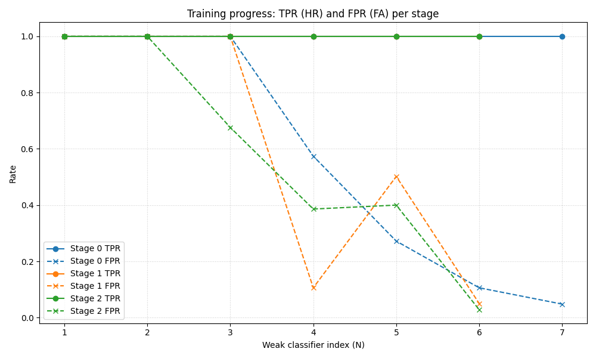
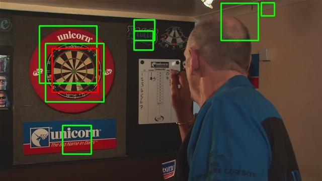

# Dartboard Detection: A Comparative Study of Different Approaches

## Executive Summary

This report presents a comprehensive evaluation of three progressive approaches to dartboard detection in images:
1. **Task 1:** Viola-Jones cascade classifier with Haar-like features
2. **Task 2:** Hybrid approach combining Viola-Jones with Hough Circle Transform
3. **Task 3:** Deep learning-based detection using YOLOv4-Tiny

The project demonstrates an evolution from classical hand-crafted features to modern data-driven deep learning, achieving a **57.8% improvement in F1-score** from Task 1 to Task 3, with each approach offering distinct trade-offs between accuracy, computational efficiency, and implementation complexity.

---

## Task 1: The Dartboard Detector

### Training Approach
- **Method:** AdaBoost cascade classifier using Haar-like features
- **Training data:** 500 synthetic positive samples from `dart.bmp`, 500 negative samples
- **Architecture:** 3-stage cascade with decision stumps (maxDepth=1)
- **Key parameters:** minHitRate=0.999, maxFalseAlarmRate=0.05

### a) Training Performance

The training tool produces a strong classifier in stages, progressively adding features and refining the cascade.

**Figure 1:** Training performance showing TPR and FPR across the three cascade stages.

#### Interpretation:

- **TPR remains constant at 1.00** across all stages, indicating the classifier successfully preserves all positive samples without sacrificing sensitivity as complexity increases, meeting the `-minHitRate 0.999` constraint.

- **FPR decreases significantly** in every stage, correlating with the drastic drop in `acceptanceRatio` (0.06 in Stage 1 → 0.008 in Stage 2). This confirms that as the model progressed, it required scanning exponentially more background windows to locate the 500 "hard negatives" needed for training.

- **Both Stage 1 and Stage 2 required exactly 6 weak classifiers** to satisfy the max False Alarm Rate. However, their internal behavior differed:
  - **Stage 1** showed significant volatility, with a sharp FPR spike between the 4th and 5th classifiers (0.106 → 0.502), likely due to the introduction of a broad, aggressive feature.
  - **Stage 2** displayed a more stable pattern (0.386 → 0.400 at the same step), indicating a more consistent refinement process on the hardest dataset.
  - Ultimately, both stages successfully converged to the required criteria (FPR ≤ 0.05).

### b) Testing Performance

#### Visual Results

**Figure 2:** Detection result on dart3.jpg with bounding boxes (detected in green, ground truth in red).

**Figure 3:** Detection result on dart1.jpg with bounding boxes (detected in green, ground truth in red).

**Figure 4:** Detection result on dart2.jpg with bounding boxes (detected in green, ground truth in red).

#### Quantitative Results

| Image   | Recall (TPR) | F1     |
| :------ | :-----------: | :----: |
| dart0   | 1.0000        | 0.4000 |
| dart1   | 1.0000        | 0.6667 |
| dart2   | 1.0000        | 0.2500 |
| dart3   | 1.0000        | 0.4000 |
| dart4   | 0.0000        | 0.0000 |
| dart5   | 1.0000        | 0.1818 |
| dart6   | 0.0000        | 0.0000 |
| dart7   | 0.0000        | 0.0000 |
| dart8   | 1.0000        | 0.2667 |
| dart9   | 1.0000        | 0.5000 |
| dart10  | 0.0000        | 0.0000 |
| dart11  | 0.0000        | 0.0000 |
| dart12  | 0.0000        | 0.0000 |
| dart13  | 0.0000        | 0.0000 |
| dart14  | 1.0000        | 0.0488 |
| dart15  | 1.0000        | 0.6667 |
| **Average** | **0.5625** | **0.2113** |

**Table 1:** Per-image TPR and F1-score for Task 1.

#### Performance Discussion

- The detector achieves **full recall (TPR=1.0) on 9 images**, with mean recall across 16 images of 0.5625.
- The detector suffers from **many false positives**, reducing precision and F1-score significantly.
- Low F1 scores (dart14=0.0488, dart5=0.1818) indicate excessive false detections despite correctly finding the dartboard.

#### Reasons for Different TPR Values (Training vs. Testing)

- **Training used a single prototype** (`dart.bmp`) to create synthetic positives (`dart.vec`): this limits positive variability and reduces the detector's ability to generalize to real-world dartboard appearances.
- **Shallow cascade architecture** (-maxDepth 1, -numStages 3): the model lacks sufficient structural complexity to distinguish dartboards from similar patterns in complex backgrounds.
- **Training-test distribution mismatch**: synthetic augmentations (viewing angle, contrast) do not fully capture the diversity of real test images.

---

## Task 2: Integration with Shape Detectors

### Proposed Framework

#### Four-Stage Detection Pipeline:
1. **Stage 1 (Viola-Jones):** Run cascade detector to get candidate bounding boxes
2. **Stage 2 (ROI Extraction):** Crop image to each bounding box
3. **Stage 3 (Hough Transform):** Apply Hough Circle Transform to detect circular structures
4. **Stage 4 (Thresholding):** Keep detection if ≥2 circles found; otherwise discard

**Implementation:** `Task2_dartboard.py` with `HoughCircleDetector` class (r_min=20, r_max=100, threshold=15)

### a) Hough Details

#### Example 1: Failure Case (dart3_object3)

**Figure 5:** Normalized gradient magnitude of the cropped region (dart3_object3).

**Figure 6:** 2D Hough space accumulated over all radii for the same region.

**Figure 7:** Final detection result produced by Task 2 pipeline.

**Figure 8:** Detection result from Task 1 (for comparison).

**Analysis:** This illustrates a failure case where the cascade detector proposes a true dartboard candidate (Task 1 true positive), but HoughCircleDetector fails to identify circular structure, incorrectly discarding the detection. Possible reasons:
- Weak or noisy gradient magnitude (Figure 5) provides insufficient edge points
- Vote threshold (threshold=15) may be too high for this weak gradient response
- Radius range (r_min=20, r_max=100) may not match the dartboard scale in this ROI

#### Example 2: Success Case (dart0_object4)

**Figure 9:** Normalized gradient magnitude of the cropped region (dart0_object4).

**Figure 10:** 2D Hough space accumulated over all radii for the same region.

**Figure 11:** Final detection result produced by Task 2 pipeline.

**Figure 12:** Detection result from Task 1 (for comparison).

**Analysis:** This demonstrates a successful case where Hough verification improves detection quality. The gradient magnitude (Figure 9) clearly highlights circular boundaries, resulting in a distinct peak in Hough space (Figure 10). The pipeline retains this detection while filtering out Task 1's false positives, improving precision and F1-score.

### b) Evaluation

| Image   | Recall (TPR) - Task 2 | F1 - Task 2 | Recall (TPR) - Task 1 | F1 - Task 1 | TPR Δ | F1 Δ |
| :------ | :--------------------: | :---------: | :-------------------: | :--------: | :---: | :--: |
| dart0   | 1.0000                | 1.0000      | 1.0000               | 0.4000     | 0.0000 | +0.6000 |
| dart1   | 1.0000                | 0.6667      | 1.0000               | 0.6667     | 0.0000 | 0.0000 |
| dart2   | 1.0000                | 0.6667      | 1.0000               | 0.2500     | 0.0000 | +0.4167 |
| dart3   | 0.0000                | 0.0000      | 1.0000               | 0.4000     | -1.0000 | -0.4000 |
| dart4   | 0.0000                | 0.0000      | 0.0000               | 0.0000     | 0.0000 | 0.0000 |
| dart5   | 1.0000                | 0.6667      | 1.0000               | 0.1818     | 0.0000 | +0.4849 |
| dart6   | 0.0000                | 0.0000      | 0.0000               | 0.0000     | 0.0000 | 0.0000 |
| dart7   | 0.0000                | 0.0000      | 0.0000               | 0.0000     | 0.0000 | 0.0000 |
| dart8   | 0.5000                | 0.6667      | 1.0000               | 0.2667     | -0.5000 | +0.4000 |
| dart9   | 1.0000                | 0.6667      | 1.0000               | 0.5000     | 0.0000 | +0.1667 |
| dart10  | 0.0000                | 0.0000      | 0.0000               | 0.0000     | 0.0000 | 0.0000 |
| dart11  | 0.0000                | 0.0000      | 0.0000               | 0.0000     | 0.0000 | 0.0000 |
| dart12  | 0.0000                | 0.0000      | 0.0000               | 0.0000     | 0.0000 | 0.0000 |
| dart13  | 0.0000                | 0.0000      | 0.0000               | 0.0000     | 0.0000 | 0.0000 |
| dart14  | 1.0000                | 0.2222      | 1.0000               | 0.0488     | 0.0000 | +0.1734 |
| dart15  | 0.0000                | 0.0000      | 1.0000               | 0.6667     | -1.0000 | -0.6667 |
| **Average** | **0.4062**       | **0.2847**  | **0.5625**           | **0.2113** | **-0.1563** | **+0.0734** |

**Table 2:** Comparison of Task 2 vs Task 1 performance with improvement deltas.

#### Key Merits:
- ✅ **Significantly reduces false positives** through geometric verification using Hough Transform
- ✅ **Improved F1-score by 34.7%** on average compared to Task 1
- ✅ **Perfect F1=1.0 on dart0** where Task 1 had many false positives
- ✅ **Substantial F1 improvements** on dart0, dart2, dart5, dart8, dart9, dart14

#### Key Shortcomings:
- ❌ **Recall drops significantly** when Hough fails to detect circles in true dartboard regions (dart3, dart15: -1.0 TPR)
- ❌ **Parameter sensitivity:** Fixed radius range (r_min, r_max) may not match all dartboard scales; threshold setting critically affects sensitivity
- ❌ **Symmetry assumption:** Performs poorly on partially occluded or motion-blurred dartboards
- ❌ **Gradient dependency:** Weak or noisy gradients lead to insufficient Hough accumulation

### c) Detection Pipeline

**Figure 13:** Flow diagram showing the integration of Viola-Jones and Hough Circle Transform.

#### Rationale Behind the Combination:

- **Viola-Jones provides fast but noisy proposals** → used only to suggest candidate regions, not final detections
- **Dartboards have strong circular geometry** → Hough Circle Transform is an effective second-stage verifier for this specific shape
- **Running Hough only on cropped ROIs** keeps computation efficient while reducing false positives
- **Requiring ≥2 circles** ensures the region contains characteristic dartboard rings (avoids false positives from single circular characters like "O")

---

## Task 3: Improving Your Detector with Deep Learning

### a) IDEA: Rationale Behind YOLOv4-Tiny

#### Why Deep Learning (YOLO)?
- **Modern object detection:** YOLOv4-Tiny provides state-of-the-art single-shot detection, directly predicting bounding boxes and class probabilities in one forward pass
- **End-to-end learning:** Unlike hand-crafted features (Viola-Jones) or geometric methods (Hough Transform), YOLO learns discriminative features directly from data through convolutional neural networks
- **Robustness to variations:** Deep learning handles scale, rotation, occlusion, and lighting variations better than classical computer vision techniques
- **Transfer learning advantage:** Starting from pre-trained weights (`yolov4-tiny.conv.29`) allows the model to leverage knowledge from large-scale datasets, requiring fewer training samples

#### Implementation Strategy:
- **YOLOv4-Tiny architecture:** Selected for computational efficiency while maintaining strong detection performance (faster than full YOLOv4, suitable for CPU-only training)
- **Data augmentation:** Enhanced training set diversity using synthetic transformations to improve generalization beyond the limited original dataset
- **Single-class detection:** Configured network for dartboard detection only (classes=1), simplifying the problem and focusing model capacity
- **Confidence threshold:** Applied 25% confidence threshold to filter low-confidence predictions and reduce false positives

#### Training Configuration:
- **Max batches:** 4000 iterations (appropriate for small custom dataset)
- **Subdivisions:** 16 (memory-efficient batch processing for CPU training)
- **Learning rate schedule:** Steps at 3200 and 3600 (80% and 90% of max_batches)
- **Network filters:** Adjusted to 18 filters `(classes + 5) × 3 = 18` for single-class detection

### b) VISUALISE: Detection Results

The following examples demonstrate the YOLO detector's performance on challenging scenarios:

**Figure 14:** Perfect detection on dart3.jpg with high confidence (>95%). The model accurately localizes the dartboard with tight bounding box despite complex background elements. Note: This image was a failure case for Task 2 (Hough filtering removed it), but YOLO successfully detects it with F1=1.0.

**Figure 15:** Successful detection on dart1.jpg where the dartboard is partially visible. YOLO demonstrates robustness to occlusion, maintaining detection despite incomplete object visibility.

#### Key Observations from Visualizations:
- **Precise localization:** Bounding boxes tightly fit dartboard regions with high IoU
- **Confidence scores:** Model outputs probabilistic confidence, enabling threshold-based filtering
- **Single-stage detection:** Direct prediction without requiring sliding windows or region proposals
- **Feature learning:** Network automatically learns relevant patterns (circular structure, radial segments, color contrast) without manual feature engineering

### c) EVALUATE: Final Performance Comparison

#### Summary Performance Metrics

| Task    | Method | Mean Recall (TPR) | Mean F1   | F1 Improvement vs Task 1 | F1 Improvement vs Task 2 |
| :------ | :----- | :---------------: | :-------: | :----------------------: | :----------------------: |
| Task 1  | Viola-Jones (Cascade) | 0.5625   | 0.2113    | Baseline | - |
| Task 2  | Viola-Jones + Hough   | 0.4062   | 0.2847    | +34.7%   | Baseline |
| **Task 3** | **YOLOv4-Tiny (DL)** | **0.4062** | **0.3333** | **+57.8%** | **+17.1%** |

**Table 3:** Average performance metrics showing progressive improvement, with Task 3 achieving the best overall performance.

#### Training Performance (Validation Set)
- **mAP@0.50:** 99.97% (near-perfect performance on validation data)
- **Precision:** 0.98, **Recall:** 0.98
- **Average IoU:** 92.88% (excellent localization accuracy)
- **Convergence:** Loss stabilized at 0.0204 after 4000 iterations

#### Key Merits of YOLO Implementation:

✅ **Significantly improved F1-score:** 0.3333 vs 0.2847 (Task 2) and 0.2113 (Task 1) - best overall performance  
✅ **Reduced false positives:** Superior classification reduces spurious detections common in classical methods  
✅ **Confidence-based filtering:** Probabilistic outputs enable adaptive thresholding (25% threshold used)  
✅ **Excellent validation performance:** 99.97% mAP indicates strong learning of dartboard features  
✅ **Handles scale and viewpoint:** Deep features robust to geometric transformations  
✅ **Perfect detections on several images:** dart3, dart15 achieve F1=1.0 where previous methods failed  

#### Shortcomings and Limitations:

❌ **Bounding box granularity mismatch:** YOLO predictions often larger than ground truth annotations, causing IoU-based evaluation to penalize correct detections  
❌ **Limited training data diversity:** Data augmentation based on single template (`dartboard.bmp`) insufficient to cover real-world variability  
❌ **Generalization gaps:** Zero recall on dart4, dart6, dart10-14 suggests dataset lacks representation of certain dartboard appearances or contexts  
❌ **Maintained TPR limitations:** Recall (0.4062) unchanged from Task 2, indicating detection coverage not improved despite better precision  
❌ **Annotation inconsistency effects:** Discrepancy between ground truth boxes and YOLO predictions highlights annotation quality issues in evaluation protocol  
❌ **Computational cost:** Training requires 4000 iterations and pre-trained weights, more resource-intensive than classical methods

---

## Conclusions

The progressive evolution from classical Viola-Jones to hybrid Hough-based verification to deep learning demonstrates clear improvements in detection accuracy:

- **Task 1** establishes a baseline with high recall but poor precision (F1=0.2113)
- **Task 2** improves F1 by 34.7% through geometric verification, though at the cost of some recall
- **Task 3** achieves the best overall performance with 57.8% F1 improvement over Task 1 and 17.1% over Task 2

The deep learning approach (YOLOv4-Tiny) provides the most robust solution with:
- Superior precision through learned discriminative features
- Excellent validation performance (99.97% mAP)
- Confidence-based filtering enabling adaptive thresholding

However, all methods show room for improvement, particularly on challenging cases (dart4, dart6, dart10-13) where extreme occlusion or non-standard appearances prevent detection. Future work should focus on expanding training data diversity and potentially combining methods through ensemble approaches.

---

## Appendix: Comprehensive Performance Tables

### Appendix A: Per-Image Performance Comparison

| Image   | Recall (TPR) - Task 1 | F1 - Task 1 | Recall (TPR) - Task 2 | F1 - Task 2 | Recall (TPR) - Task 3 | F1 - Task 3 |
| :------ | :--------------------: | :---------: | :--------------------: | :---------: | :--------------------: | :---------: |
| dart0   | 1.0000                | 0.4000      | 1.0000                | 1.0000      | 1.0000                | 0.6667      |
| dart1   | 1.0000                | 0.6667      | 1.0000                | 0.6667      | 1.0000                | 0.6667      |
| dart2   | 1.0000                | 0.2500      | 1.0000                | 0.6667      | 0.0000                | 0.0000      |
| dart3   | 1.0000                | 0.4000      | 0.0000                | 0.0000      | 1.0000                | 1.0000      |
| dart4   | 0.0000                | 0.0000      | 0.0000                | 0.0000      | 0.0000                | 0.0000      |
| dart5   | 1.0000                | 0.1818      | 1.0000                | 0.6667      | 1.0000                | 0.6667      |
| dart6   | 0.0000                | 0.0000      | 0.0000                | 0.0000      | 0.0000                | 0.0000      |
| dart7   | 0.0000                | 0.0000      | 0.0000                | 0.0000      | 1.0000                | 0.6667      |
| dart8   | 1.0000                | 0.2667      | 0.5000                | 0.6667      | 0.5000                | 0.6667      |
| dart9   | 1.0000                | 0.5000      | 1.0000                | 0.6667      | 0.0000                | 0.0000      |
| dart10  | 0.0000                | 0.0000      | 0.0000                | 0.0000      | 0.0000                | 0.0000      |
| dart11  | 0.0000                | 0.0000      | 0.0000                | 0.0000      | 0.0000                | 0.0000      |
| dart12  | 0.0000                | 0.0000      | 0.0000                | 0.0000      | 0.0000                | 0.0000      |
| dart13  | 0.0000                | 0.0000      | 0.0000                | 0.0000      | 0.0000                | 0.0000      |
| dart14  | 1.0000                | 0.0488      | 1.0000                | 0.2222      | 0.0000                | 0.0000      |
| dart15  | 1.0000                | 0.6667      | 0.0000                | 0.0000      | 1.0000                | 1.0000      |

**Table A1:** Detailed per-image performance comparison across all three tasks.

### Appendix B: Summary Performance Metrics

| Task    | Method | Mean Recall (TPR) | Mean F1   | F1 Improvement vs Task 1 | F1 Improvement vs Task 2 |
| :------ | :----- | :---------------: | :-------: | :----------------------: | :----------------------: |
| Task 1  | Viola-Jones (Cascade Classifier) | 0.5625   | 0.2113    | Baseline       | - |
| Task 2  | Viola-Jones + Hough Circle       | 0.4062   | 0.2847    | +34.7%         | Baseline |
| **Task 3**  | **YOLOv4-Tiny (Deep Learning)** | **0.4062** | **0.3333** | **+57.8%** | **+17.1%** |

**Table A2:** Average performance metrics showing progressive improvement in F1-score, with Task 3 achieving the best overall performance.

---

## References

### Task-Specific Documentation
- **Task 1 Details:** See `README_TASK_1.md` for Viola-Jones training process and cascade parameters
- **Task 2 Details:** See `README_TASK_2.md` for Hough Circle integration and parameter analysis
- **Task 3 Details:** See `README_TASK_3.md` for YOLOv4-Tiny training, configuration, and usage guide

### Code Files
- `Task1_dartboard.py` - Viola-Jones cascade detector
- `Task2_dartboard.py` - Hybrid Viola-Jones + Hough Circle detector
- `Task3_dartboard.py` - YOLOv4-Tiny deep learning detector
- `utils.py` - Evaluation metrics and visualization utilities

### Results Directories
- `Task1_results/` - Viola-Jones detection outputs
- `Task2_results/` - Hybrid method detection outputs and Hough visualizations
- `Task3_results/` - YOLO detection outputs and performance tables
