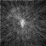
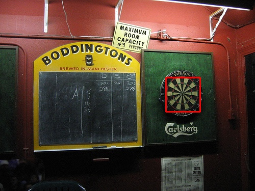
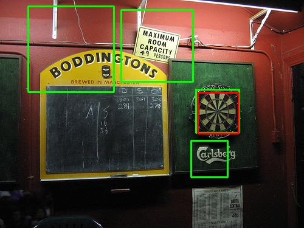
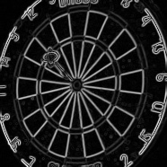
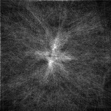
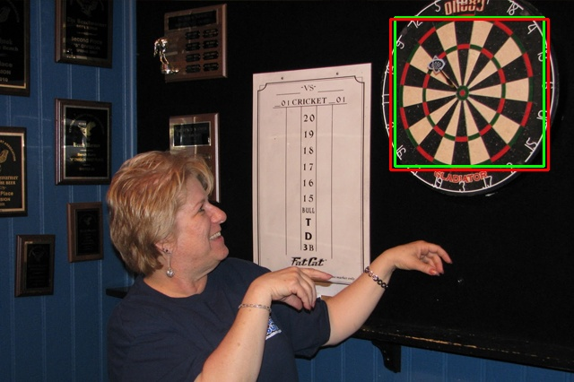
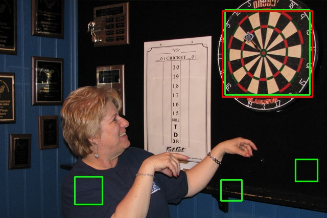
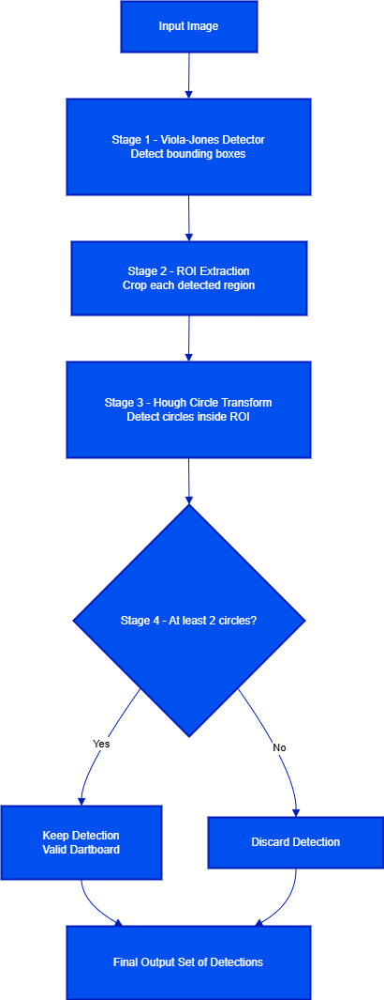

# Subtask 2: Integration with Shape Detectors
## Step-by-step Proposed Framework
1. Stage 1 (Viola-Jones with Haar-like Feature): Run `object = model.detectMultiScale(frame_gray, scaleFactor=1.1, minNeighbors=3, flags=0, minSize=(10,10), maxSize=(300,300))`. We get a list of bounding boxes $(x, y, w, h)$.
2. Stage 2 (ROI Extraction): Crop the image to that bounding box.
3. Stage 3 (Hough Transform): Run Hough Circel Transformation on this small ROI to detect circle (for dartboard) inside the images.
4. Stage 4 (Thresholding):
    - If the Hough accumulator finds at least 2 circles from the cropped region, we keep that detection.
    - Else, discard the detection.

Clear code implementing this method can be seen insider `Task2_dartboard.py` through class `HoughCircleDetector` and `Detector_Hough`. The experiments was runned using default paramters of HoughCircelDetector which are `r_min=20, r_max=100, threshold=15`.
## HOUGH DETAILS
**Firs Example** (Fail Example)

**Figure 1.1: Normalized gradient magnitude of the cropped region (dart3_object3)**

**Figure 1.2: 2D Hough space accumulated over all radii for the same region**

**Figure 1.3: Final detection result produced by the full pipeline (Task 2)**

**Figure 1.4: Detection result from Task 1 using the pre-implemented HoughCircleDetector**

This example illustrates one of the failure cases in the combined cascade + Hough pipeline. Although the cascaded detector proposes a region that is a true dartboard candidate (i.e., a true positive in Task 1), the HoughCircleDetector is unable to identify any valid circular structure inside the cropped region. As a result, the system incorrectly discards this detection during Task 2, turning a true positive into a false negative.

Several factors may explain why the Hough-based verification fails to detect a circle in this region:

- The minimum radius (r_min = 10) may be too small, causing the detector to ignore circles larger than this threshold within the cropped window.

- The vote threshold (threshold = 15) may be too high, preventing weaker circle candidates from being recognised.

- The gradient magnitude within the region is weak or noisy, as seen in Figure 1.1, resulting in insufficient edge points to accumulate a strong peak in the Hough space.

**Second Example** (Successful Example)

**Figure 2.1: Normalized gradient magnitude of the cropped region (dart0_object4)**

**Figure 2.2: 2D Hough space accumulated over all radii for the same region**

**Figure 2.3: Final detection result produced by the full pipeline (Task 2)**

**Figure 2.4: Detection result from Task 1 using the pre-implemented HoughCircleDetector**

This example demonstrates a successful case where the integration of the custom HoughCircleDetector improves the overall detection quality. In Figure 2.1, the gradient magnitude clearly highlights the circular boundaries of the dartboard, resulting in strong and well-defined edge responses. Correspondingly, Figure 2.2 shows a distinct peak in the 2D Hough space, indicating consistent circular structure across the examined radii.

As shown in Figure 2.3, the full pipeline retains this detection since the Hough verification confirms the presence of multiple circular candidates within the cropped region. In contrast, the original Task 1 detector (Figure 2.4) tends to keep more false positives due to relying solely on the cascade classifier.

In this case, incorporating the HoughCircleDetector successfully removes non-circular false detections while preserving true dartboard regions. This selective filtering improves the precision of the system and contributes to the overall increase in F1 score observed in Task 2.

## Evaluation

| Image   | Recall (TPR) - Task 2 | F1 - Task 2 | Recall (TPR) - Task 1 | F1 - Task 1 |
| :------ | :--------------------: | :---------: | :-------------------: | :--------: |
| dart0   | 1.0000                | 1.0000      | 1.0000               | 0.4000     |
| dart1   | 1.0000                | 0.6667      | 1.0000               | 0.6667     |
| dart2   | 1.0000                | 0.6667      | 1.0000               | 0.2500     |
| dart3   | 0.0000                | 0.0000      | 1.0000               | 0.4000     |
| dart4   | 0.0000                | 0.0000      | 0.0000               | 0.0000     |
| dart5   | 1.0000                | 0.6667      | 1.0000               | 0.1818     |
| dart6   | 0.0000                | 0.0000      | 0.0000               | 0.0000     |
| dart7   | 0.0000                | 0.0000      | 0.0000               | 0.0000     |
| dart8   | 0.5000                | 0.6667      | 1.0000               | 0.2667     |
| dart9   | 1.0000                | 0.6667      | 1.0000               | 0.5000     |
| dart10  | 0.0000                | 0.0000      | 0.0000               | 0.0000     |
| dart11  | 0.0000                | 0.0000      | 0.0000               | 0.0000     |
| dart12  | 0.0000                | 0.0000      | 0.0000               | 0.0000     |
| dart13  | 0.0000                | 0.0000      | 0.0000               | 0.0000     |
| dart14  | 1.0000                | 0.2222      | 1.0000               | 0.0488     |
| dart15  | 0.0000                | 0.0000      | 1.0000               | 0.6667     |

### Average Metrics

- **Mean Recall (TPR):**: 0.4062
- **Mean F1**: 0.2847

### Key Advantages:
- Reduces false positives by verifying circular structures using the Hough Transform.

- Improves F1-score on multiple images where Task 1 had many spurious detections (e.g., dart0, dart2, dart5, dart14).

### Key Disadvantages:
- Recall and F1-Score decreases significantly when the Hough stage fails to detect circles in a true dartboard region (e.g., dart3, dart15).
- Parameter sensitivity:

    - Fixed radius range (r_min, r_max) may not match all dartboard scales.

    - Threshold setting influences sensitivity → too high removes true positives; too low adds noise.
- Symmetry Assumption: -> poorly on partially occluded or motion-blurred dartboards.

## DETECTION PIPELINE:

**Figure 3: Flow Diagram of Proposed Method**

**Rationale Behind the Combination**

- Viola–Jones provides fast but noisy proposals, so it is used only to suggest candidate regions.

- Dartboards have strong circular geometry, making the **Hough Circle Transform** an effective second-stage verifier.

- Running Hough only on cropped ROIs keeps computation efficient while reducing false positives.

- Requiring at least two circles to ensure the region contains the characteristic dartboard rings. (avoid examples when there is circle-like character ("O")  in the region).