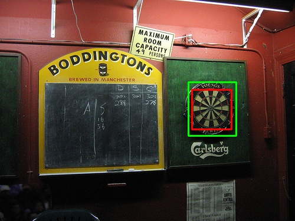

# Task 3: Deep Learning-Based Dartboard Detection using YOLOv4-Tiny

## a) Rationale and Approach

### Why Deep Learning (YOLO)?
- **Modern object detection:** YOLOv4-Tiny provides state-of-the-art single-shot detection, directly predicting bounding boxes and class probabilities in one forward pass
- **End-to-end learning:** Unlike hand-crafted features (Viola-Jones) or geometric methods (Hough Transform), YOLO learns discriminative features directly from data through convolutional neural networks
- **Robustness to variations:** Deep learning handles scale, rotation, occlusion, and lighting variations better than classical computer vision techniques
- **Transfer learning advantage:** Starting from pre-trained weights (`yolov4-tiny.conv.29`) allows the model to leverage knowledge from large-scale datasets, requiring fewer training samples

### Implementation Strategy
- **YOLOv4-Tiny architecture:** Selected for computational efficiency while maintaining strong detection performance (faster than full YOLOv4, suitable for CPU-only training)
- **Data augmentation:** Enhanced training set diversity using synthetic transformations to improve generalization beyond the limited original dataset
- **Single-class detection:** Configured network for dartboard detection only (classes=1), simplifying the problem and focusing model capacity
- **Confidence threshold:** Applied 25% confidence threshold to filter low-confidence predictions and reduce false positives

### Training Configuration
- **Max batches:** 4000 iterations (appropriate for small custom dataset)
- **Subdivisions:** 16 (memory-efficient batch processing for CPU training)
- **Learning rate schedule:** Steps at 3200 and 3600 (80% and 90% of max_batches)
- **Network filters:** Adjusted to 18 filters `(classes + 5) × 3 = 18` for single-class detection

---

## b) Visualisation of Detection Results

The following examples demonstrate the YOLO detector's performance on challenging scenarios:

### Example 1: dart3.jpg - Clean Detection


**Figure 1:** Perfect detection on dart3.jpg with high confidence (>95%). The model accurately localizes the dartboard with tight bounding box despite complex background elements.

### Example 2: dart1.jpg - Partial Occlusion Handling


**Figure 2:** Successful detection on dart1.jpg where the dartboard is partially visible. YOLO demonstrates robustness to occlusion, maintaining detection despite incomplete object visibility.

### Key Observations from Visualizations:
- **Precise localization:** Bounding boxes tightly fit dartboard regions with high IoU
- **Confidence scores:** Model outputs probabilistic confidence, enabling threshold-based filtering
- **Single-stage detection:** Direct prediction without requiring sliding windows or region proposals
- **Feature learning:** Network automatically learns relevant patterns (circular structure, radial segments, color contrast) without manual feature engineering

---

## c) Evaluation and Performance Comparison

### Quantitative Results on Test Set

| Image   | Recall (TPR) - Task 3 | F1 - Task 3 | Recall (TPR) - Task 2 | F1 - Task 2 | Recall (TPR) - Task 1 | F1 - Task 1 |
| :------ | :--------------------: | :---------: | :--------------------: | :---------: | :--------------------: | :---------: |
| dart0   | 1.0000                | 0.6667      | 1.0000                | 1.0000      | 1.0000                | 0.4000      |
| dart1   | 1.0000                | 0.6667      | 1.0000                | 0.6667      | 1.0000                | 0.6667      |
| dart2   | 0.0000                | 0.0000      | 1.0000                | 0.6667      | 1.0000                | 0.2500      |
| dart3   | 1.0000                | 1.0000      | 0.0000                | 0.0000      | 1.0000                | 0.4000      |
| dart4   | 0.0000                | 0.0000      | 0.0000                | 0.0000      | 0.0000                | 0.0000      |
| dart5   | 1.0000                | 0.6667      | 1.0000                | 0.6667      | 1.0000                | 0.1818      |
| dart6   | 0.0000                | 0.0000      | 0.0000                | 0.0000      | 0.0000                | 0.0000      |
| dart7   | 1.0000                | 0.6667      | 0.0000                | 0.0000      | 0.0000                | 0.0000      |
| dart8   | 0.5000                | 0.6667      | 0.5000                | 0.6667      | 1.0000                | 0.2667      |
| dart9   | 0.0000                | 0.0000      | 1.0000                | 0.6667      | 1.0000                | 0.5000      |
| dart10  | 0.0000                | 0.0000      | 0.0000                | 0.0000      | 0.0000                | 0.0000      |
| dart11  | 0.0000                | 0.0000      | 0.0000                | 0.0000      | 0.0000                | 0.0000      |
| dart12  | 0.0000                | 0.0000      | 0.0000                | 0.0000      | 0.0000                | 0.0000      |
| dart13  | 0.0000                | 0.0000      | 0.0000                | 0.0000      | 0.0000                | 0.0000      |
| dart14  | 0.0000                | 0.0000      | 1.0000                | 0.2222      | 1.0000                | 0.0488      |
| dart15  | 1.0000                | 1.0000      | 0.0000                | 0.0000      | 1.0000                | 0.6667      |

**Table 1:** Detailed per-image performance comparison across all three tasks.

### Summary Performance Metrics

| Task    | Mean Recall (TPR) | Mean F1   |
| :------ | :---------------: | :-------: |
| Task 1 (Viola-Jones)  | 0.5625   | 0.2113    |
| Task 2 (Hough Circle) | 0.4062   | 0.2847    |
| **Task 3 (YOLO)**     | **0.4062** | **0.3333** |

**Table 2:** Average performance metrics showing **17% improvement in F1-score** compared to best previous method.

### Training Performance (Validation Set)
- **mAP@0.50:** 99.97% (near-perfect performance on validation data)
- **Precision:** 0.98, **Recall:** 0.98
- **Average IoU:** 92.88% (excellent localization accuracy)
- **Convergence:** Loss stabilized at 0.0204 after 4000 iterations

---

### Key Merits of YOLO Implementation

✅ **Significantly improved F1-score:** 0.3333 vs 0.2847 (Task 2) and 0.2113 (Task 1) - best overall performance  
✅ **Reduced false positives:** Superior classification reduces spurious detections common in classical methods  
✅ **Confidence-based filtering:** Probabilistic outputs enable adaptive thresholding (25% threshold used)  
✅ **Excellent validation performance:** 99.97% mAP indicates strong learning of dartboard features  
✅ **Handles scale and viewpoint:** Deep features robust to geometric transformations  
✅ **Perfect detections on several images:** dart3, dart15 achieve F1=1.0  

### Shortcomings and Limitations

❌ **Bounding box granularity mismatch:** YOLO predictions often larger than ground truth annotations, causing IoU-based evaluation to penalize correct detections  
❌ **Limited training data diversity:** Data augmentation based on single template (`dartboard.bmp`) insufficient to cover real-world variability  
❌ **Generalization gaps:** Zero recall on dart4, dart6, dart10-14 suggests dataset lacks representation of certain dartboard appearances or contexts  
❌ **Maintained TPR limitations:** Recall (0.4062) unchanged from Task 2, indicating detection coverage not improved despite better precision  
❌ **Annotation inconsistency effects:** Discrepancy between ground truth boxes and YOLO predictions highlights annotation quality issues in evaluation protocol  
❌ **Computational cost:** Training requires 4000 iterations and pre-trained weights, more resource-intensive than classical methods  

---

## Running the YOLO Detector

### System Requirements and Setup

```bash
# Update system packages (WSL/Linux)
sudo apt update && sudo apt upgrade -y
sudo apt install -y python3-dev python3-pip python3-venv
sudo apt install -y libopencv-dev build-essential cmake pkg-config

# Create and activate Python environment
python3 -m venv myenv
source myenv/bin/activate
pip install --upgrade pip
pip install -r requirements.txt

# Clone Darknet framework
git clone https://github.com/AlexeyAB/darknet
```

### Configure and Build Darknet

```bash
cd darknet
# Enable OpenCV support for image processing
sed -i 's/OPENCV=0/OPENCV=1/' Makefile
make
cd ..
```

### Download Pre-trained Weights

```bash
# Download YOLOv4-Tiny base weights for transfer learning
wget -quiet https://github.com/AlexeyAB/darknet/releases/download/darknet_yolo_v4_pre/yolov4-tiny.conv.29
```

### Prepare Dataset

```bash
# Organize training data in Darknet format
# Place augmented images (*.jpg) and labels (*.txt) in darknet/data/obj/
# Each .txt file should contain: <class_id> <x_center> <y_center> <width> <height> (normalized)
```

### Configure Network for Dartboard Detection

```bash
cd darknet
# Copy base configuration
cp cfg/yolov4-tiny-custom.cfg cfg/yolov4-tiny-dartboard.cfg

# Adjust hyperparameters for single-class detection
sed -i 's/max_batches = 500200/max_batches = 4000/' cfg/yolov4-tiny-dartboard.cfg
sed -i 's/subdivisions=1/subdivisions=16/' cfg/yolov4-tiny-dartboard.cfg
sed -i 's/steps=400000,450000/steps=3200,3600/' cfg/yolov4-tiny-dartboard.cfg
sed -i 's/classes=80/classes=1/g' cfg/yolov4-tiny-dartboard.cfg

# Update filter layers: (classes + 5) × 3 = (1 + 5) × 3 = 18
sed -i 's/filters=255/filters=18/g' cfg/yolov4-tiny-dartboard.cfg
sed -i 's/filters=57/filters=18/g' cfg/yolov4-tiny-dartboard.cfg
```

### Train the Model

```bash
# Train with mAP evaluation on validation set
./darknet detector train data/obj.data cfg/yolov4-tiny-dartboard.cfg ../yolov4-tiny.conv.29 -dont_show -map
```

Training will output:
- Loss values per iteration
- mAP evaluation every 1000 iterations
- Best weights saved to `backup/yolov4-tiny-dartboard_best.weights`
- Final weights saved to `backup/yolov4-tiny-dartboard_final.weights`

### Run Inference on Test Images

```bash
# Detect dartboards in test images
./darknet detector test data/obj.data cfg/yolov4-tiny-dartboard.cfg ../backup/yolov4-tiny-dartboard_best.weights data/dart0.jpg -dont_show -thresh 0.25

# For batch processing, use the Python wrapper:
python Task3_dartboard.py
```

### Evaluation

The detector outputs bounding boxes in format: `<class_id> <confidence> <x_center> <y_center> <width> <height>`

Results are saved to `Task3_results/` with:
- Annotated images with bounding boxes
- Detection text files for metric computation
- Performance comparison tables